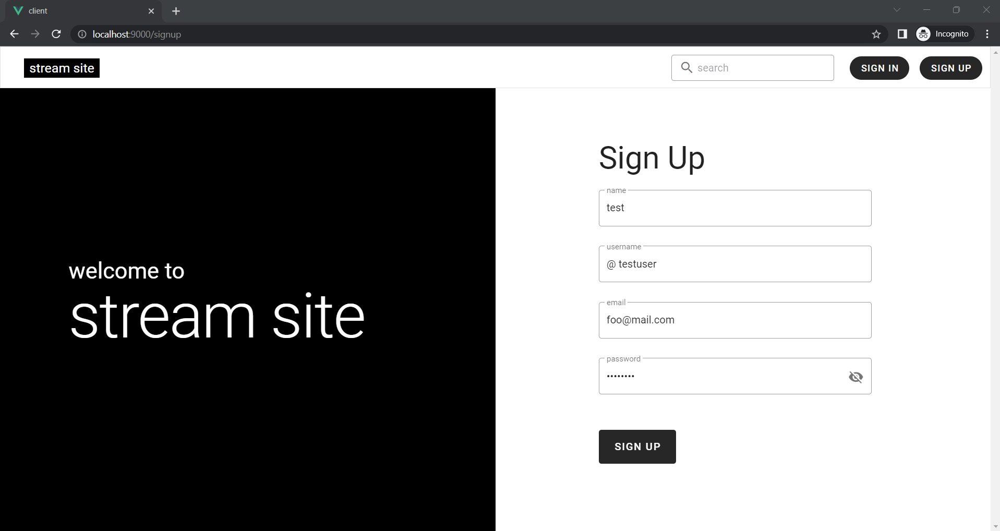
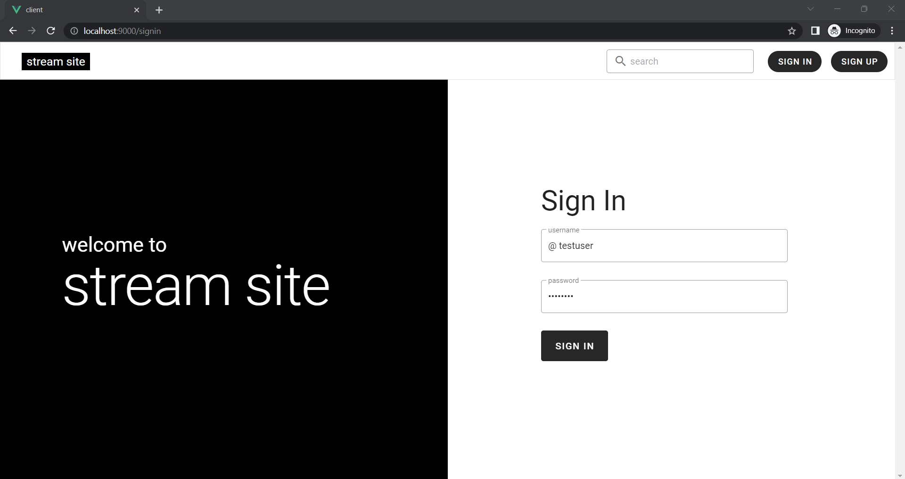
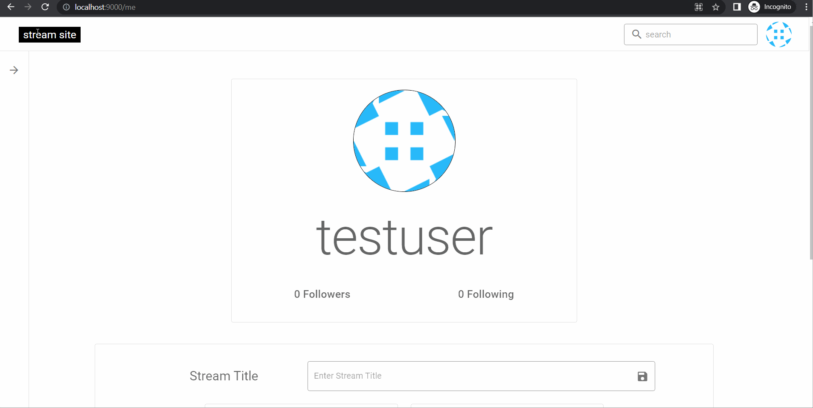
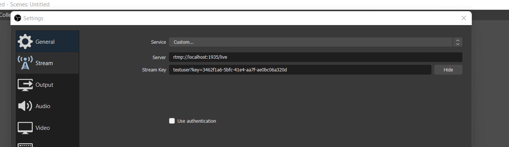

# stream-site

A Streaming Service made using Vue.JS, vuetify, nginx, socket.io

---


---

### Table Of Contents

- [Run Locally](#run-locally)
- [Develop Locally](#develop-locally)
- [Development Process](#development-process)

## Run Locally

### Intall Docker

    https://www.docker.com/

### Clone the project

```bash
  git clone https://github.com/ish-u/stream-site.git
  cd stream-site
```

### Build Images and Run to start the Express Server, RTMP Server, MongoDB and MongoExpress

```bash
docker-compose build
docker-compose up
```

### The Services will be live at the following Links

- MongoDB : `http://localhost:27017/`
- MongoExpress: `http://localhost:8080`
- RTMP Server : `rtmp://localhost:1935/live` - (`live` is the name of the application)
- HLS Feed: `http://localhost:8000`
- Express Server - `http://localhost:5000`
- Socket.IO Server - `http://localhost:3000`

### Start the Client and Start Streaming

- Install Dependencies and start the client

  ```
  cd client
  npm i
  npm run serve
  ```

- Sign Up - `http://localhost:9000/signup`

  

- Sign In - `http://localhost:9000/signin`

  

- Goto `http://localhost:9000/me` to obtain the Stream Key after signin in

  

- Open OBS and set the Stream Key as follows

  - Service - `Custom`
  - Server - `rtmp://localhost:1935/live`
  - Stream Key - `username?key=StreamKey`

  

- Start Streaming In OBS and you will be live at `http://localhost:9000/username`

  

---

## Develop Locally

**TODO**

---

## Development Process

_I documented how I got around making this project - [original google doc - 'stream-site'](https://docs.google.com/document/d/13v0R2_NqVXyiqDuDusyzNiKOEvzZMFYtqi41UNKqpB8/edit?usp=sharing)_

**STREAM SITE**

**Goal** - To Create a Streaming Service

**What needs to be done ?**

1. Create a RTMP Server that will take the Stream/s from different Users by [OBS](https://obsproject.com/) and provide different formats to consume the stream

   1. For the RTMP Server that takes in the Stream Data (RTMP Ingest - this is what I found people calling it online) we will use [nginx](https://www.nginx.com/) with a [RTMP Server Module](https://github.com/arut/nginx-rtmp-module) that is available for it .I guess there are other services available there but this package has various tutorial/guides made for it that we can use for as a starting point.
   1. Some References and Tutorial to create a nginx RTMP server for RTMP ingest and HLS,DASH or RTMP stream to consume -
      1. l[ivestreamninja](https://www.youtube.com/channel/UCNw4LP_NXVpJIAR0eSMW2uw/videos) - Streaming Architecture and Protocols Explanation
      1. [nginx rtmp server guide](https://www.nginx.com/blog/video-streaming-for-remote-learning-with-nginx/)
      1. [Peer5](https://docs.peer5.com/guides/setting-up-hls-live-streaming-server-using-nginx/) - guide to setup hls server
      1. [Create a Dockerized RTMP Server with Authentication](https://www.youtube.com/playlist?list=PL7XcC35Z6WFB3L2xLVV3S4bG_Z37MqcRe)
   1. Created [live streaming server ](https://github.com/ish-u/stream-server)from this [tutorial](https://www.youtube.com/playlist?list=PL7XcC35Z6WFB3L2xLVV3S4bG_Z37MqcRe)
   1. We need to figure out how to authenticate using the **stream key.** Currently we need to specify the stream key as **test?key=secret.**
      1. The solution according to me is to create a separate express server that will query the data to verify the stream key. The rtmp module of the nginx server has directives that can be used to send a POST request to this server that will send a 2xx response for success or 3xx for failure. According to the response sent the user will be allowed to ingest the stream to the server from OBS.
   1. We also need to do Load Balancing to better distribute the stream - I don’t quite know how to do this but it needs to be done for scalability purpose _(also i don;t know about scalability and all) - [ref](https://www.youtube.com/watch?v=px0i9ihcjuM&t=974s)_
   1. We also need to set up a reverse proxy to protect our actual server address - maybe we also need to purchase a domain for the server
   1. We will use [linode](https://www.linode.com/) to host our server

1. Create a Database to store the user details and credentials to access the streaming service
   1. We will use [mongodb](https://www.mongodb.com/) as our database
   1. The Database will store the following user details
      1. Name
      1. Userame
      1. Password
      1. Email
      1. Profile Pic - not sure how to store this but [amazon s3](https://aws.amazon.com/s3/) can be used according to the internet
      1. Streamkey
      1. Followers and Following

` `Maybe more things will be needed

1. Create the Front End of Service that the user will interact with
   1. We will use [vue.js](https://vuejs.org/) with [vuetify](https://vuetifyjs.com/en/)
   1. We will need following views and functionality in our application
      1. Sign In / Sign Up
      1. Home
         1. Discover Top Streamers
      1. Profile Page
         1. General Information that can be edited
         1. StreamKey to authenticate in OBS to stream
      1. 404
      1. Stream Page
         1. Needs a player to consume the HLS/DASH stream from our server
         1. Details about the Streamer like username, profile pic and current view count
         1. Chat - maybe - we can use websockets to implement it using socket.io I think
   1. I have never created a Design before developing for a project. I guess I can try figma to create a design or maybe just go straight to development.

20 Dec 2021

- RTMP Server Basic Setup Done

24 Dec 2021

- Express Server Setup Done
- Added routes for Registration, Login, Token Verification and Getting User/s Details

Dec 24, 2021

- Made Figma Design for Mobile version - [design](https://www.figma.com/file/v8kKCVYjqpPR5InEqQ32YJ/stream-site?node-id=0%3A1)
- Front End with VueJS + Vuetify Setup Done
- Tried implementing followers/following feature

25 Dec 2021

- Done with the Figma Design (_more of a concept_) for the website - [design](https://www.figma.com/file/v8kKCVYjqpPR5InEqQ32YJ/stream-site?node-id=0%3A1)
- Follower/Following Implementation in Server

26 Dec 2021- 28 Dec 2021

- Created Sign Up/In Home
- Created Home View (half)
- Created Profile View

29 Dec 2021 - 31 Dec 2021

- Implemented VIdeo.JS Player for the Stream View
- Fixed Vue Store Issue - the user data is fetched from the api first before displaying the **router-view /** main app
- Implemented Follower/Following Functionality
- Some improvements in the Profile Page
- Some general overall improvements

6 Jan 2022

- Implemented SocketIO Server for Chat Functionality
- Created SocketIO Events and binded them with the Client

11 Jan 2022

- Remade the Stream View
- Implemented Chat Functionality
- Some Fixes in Client

15 Jan 2022- 19 Jan 2022

- Created the Chat Functionality
- Created Live View Count and Online Status Functionality
- Moved the User Data Sync b/w Client and Server from Polling to WebSockets

22 Jan 2022- 24 Jan 2022

- Made Slider for User Discovery for Home View
- Added default video sources for some users and added robohash profile images for them
- Some Design/Bug Fixes
